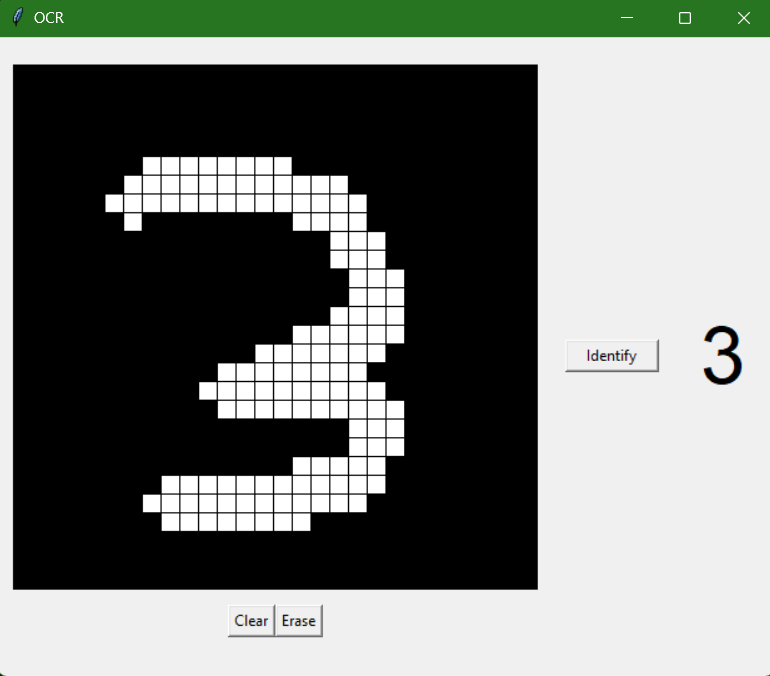

# Digit OCR

This shows use of KNN algorithm ( from scratch, no libraries) for optical character recognition for handwritten digits identification of the mnist dataset.

## Result

To see the result/accuracy for the test cases for the mnist dataset:

```bash
py ./ocr.py
```

## GUI program

The repo consists of a demo gui program to test the algorithm. The gui was created using tkinter and can be run by:

```bash
py ./main.py 
```


